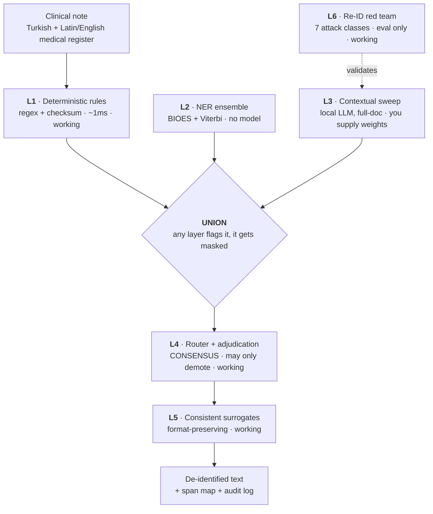

<div align="center">

# deid-tr 🇹🇷🏥

**PHI/PII de-identification for Turkish clinical text, and the benchmark that proves whether it works.**

[](LICENSE)
[](https://www.rust-lang.org)
[](#running-everything)
[](#the-invariants-and-the-hooks-that-mean-them)
[](#the-benchmark)
[](#-this-build-masks-no-names)

</div>

---

## 🚨 This build masks no names

Not patient names, not clinician names, not relatives. Here is a real run of the shipped binary
on a synthetic note:

```console
$ deid mask note.txt
Hasta Adi: Ayse Yilmaz    Dogum Tarihi: 07.06.1958
TC Kimlik No: 809########   Telefon: +90 545 911 86 66
E-posta: su.alkan@kurum.example
Konsultan: Prof. Dr. Marco Costa tarafindan degerlendirildi.
Refakatci: Adalet Demir (kizi). Hasta Merkez Bankasi'nda uzman olarak calismaktadir.
deid: masked 4 of 4 span(s)
```

The ID, the phone, the email and the birth date were replaced. `Ayse Yilmaz`, `Marco Costa` and
`Adalet Demir` are still there, in the output, untouched. So is "works as a specialist at the
Central Bank", which identifies a person without containing a name at all.

<sub>The TCKN digits above are elided because the surrogate is a checksum-valid Turkish national
ID, and I8 forbids one from existing anywhere in this repository, including in this README.</sub>

Every surface says so in its own voice rather than deferring to this file. `GET /health` on the
REST service reports `"l2_ner": {"live": false, "detail": "NO TRAINED MODEL IS LOADED..."}`,
`deid mask-file` prints the disclosure after every run, and `just deploy-check` raises it as a
warning:

```console
$ deid-serve preflight
PASS bind             loopback. Nothing off this machine can reach the service.
WARN layer-l2         L2 has NO trained model in this build, so this deployment masks ZERO NAMES.
                      PATIENT_NAME, CLINICIAN_NAME and RELATIVE_NAME are never detected. If your
                      acceptance criterion was 'names are removed', it is not met and no flag meets it.
```

The reason is boring: L2 is the neural NER ensemble and it has no trained checkpoint behind it.
The decode path, the union logic, the adjudicator, the surrogates and the file formats are all
built and tested. The model is not. See [what would actually help](#-what-would-actually-help).

**Do not put real patient data through this and send the output anywhere.** For masking names in
Turkish clinical text today, use OpenMed. That recommendation is written down in
[`docs/COMPARISON.md`](docs/COMPARISON.md) section 5 and it has not changed.

---

## What works today

Recall figures are per entity type from run `20260719T234410Z-pipeline`, over 190 documents.

| | |
|---|---|
| 🇹🇷 **Turkish national IDs** | TCKN, VKN, SGK. Recall **1.0000** each |
| 🏦 **TR IBAN** | 26 characters, mod-97. Recall **1.0000** |
| 📞 **Phone** | `+90 5XX`, `0(5XX)`, `05XX`, landlines. Recall **1.0000** |
| 📧 **Email** · 🗂️ **MRN** | Recall **1.0000** |
| 📅 **Dates** | `DATE_BIRTH` 1.0000. The other three date roles are the weak spot, see below |
| 💊 **Medical vocabulary** | 2,108 terms across 9 files. False-positive rate **0.000488** against a 0.005 gate |

One honest asterisk on TCKN: that 1.0000 comes from the regex shape, not from the check digits.
I8 forbids a checksum-valid Turkish ID in the repository, so all 128 eleven-digit runs in the gold
set fail their own checksum, and the `checksum_id_precision` gate reports `UNENFORCEABLE` rather
than `PASS`. The protection path is exercised by `core/tests/checksum_protection_armed.rs`, which
generates valid identifiers at runtime and writes none of them to disk.

The date family is the interesting failure. `DATE_BIRTH` scores 1.0000 and `DATE_ADMISSION` scores
0.5742 off the *same rule*, because L1 emits a role-less `DATE` and refuses to guess which of the
four roles it is, while the recall floors are per role. `DATE_DISCHARGE` 0.7917, `DATE_DEATH`
0.6667. That is a scoring artifact of role assignment, which explains the number without excusing
it: the gold set asks for the role and the pipeline does not supply it.

### Surrogates, not `[REDACTED]`

```diff
- TC Kimlik No: 526########
+ TC Kimlik No: 189########    (different person, still a structurally valid TCKN)
```

Downstream systems that validate the format keep working. Dates shift by one per-patient offset,
so "chemo three weeks after admission" is still three weeks after admission on fake dates. We
measured the tell rather than assuming there wasn't one: surrogate length correlates with the
original at r = 0.8867 for `DATE_ADMISSION` (n=155) and 0.8516 for `DATE_BIRTH` (n=90). Both are
recorded in D-028. `--placeholder-labels` opts out of surrogates entirely.

### File formats

`deid mask-file IN --out OUT` handles txt, csv, json, jsonl, docx and pdf, detected by content
first and file name second.

```console
$ deid mask-file hasta.csv --out hasta.masked.csv
deid: csv format, masked 2 span(s) across 2 location(s)
deid: deid-tr masks rule-detectable identifiers only (TCKN, VKN, IBAN, phone, email, MRN, date).
      It does NOT mask person names, institution names or contextual quasi-identifiers: no trained
      model is installed. Do not treat the output as name-free.
```

The PDF path is **true redaction**, not a black rectangle: content-stream removal, full file
rewrite, then re-open and re-extract to verify the text is actually gone. Two findings from
building it, measured against a real Turkish examination report held locally and never committed:

- Simple fonts were being decoded as Latin-1. Turkish clinical PDFs are Windows-1254. Fixing that
  plus reading Form XObjects took extracted page text from 48 to 1,852 characters, correctly
  decoded Turkish letters from 0 to 133, and page-level spans from 1 to 13.
- A page with both a text layer *and* images used to be masked, verified, and reported as a
  success with every pixel byte-identical. That is the common shape of hospital output, and a QR
  code carrying the protokol number is a direct identifier. Such a page is now **refused by
  default**, named by page number, image count and pixel dimensions. `--allow-images` continues
  and prints the same list beside the result. Nothing here reads a pixel, a barcode or a stamp,
  and no output is called clean over pixels that were not read.

### The three surfaces

| Surface | What it is |
|---|---|
| `deid` | the CLI. `mask`, `mask-file`, `mask --batch DIR --out DIR`, `update`, `version` |
| `deid-mcp` | stdio JSON-RPC gateway. Four tools: `deidentify`, `reidentify`, `forget`, `health`. No socket, ever |
| `deid-serve` | REST. `/health`, `/entities`, `/analyze`, `/pii/extract`, `/deidentify`, `/reidentify`, `/batch` |

The MCP gateway holds the span map so a model can work on de-identified text and you can map the
answer back. `forget` drops it early rather than waiting out the TTL.

The browser panel (`just serve-panel`) is fully client-side: the wasm module does the work, the
page uploads nothing, and a separate no-upload proof page asserts that under a shimmed network. A
hosted upload panel would break the entire value proposition, so there isn't one and there won't
be.

`deid-serve` defaults to `127.0.0.1:8787` with no flags. An all-interfaces bind is refused
unconditionally, and `--expose` plus `--token` do not unlock it.
`bindings/service/tests/no_deployment_path_binds_all_interfaces.rs` (14 tests) proves no
combination of flag, environment variable, config file or container setting reaches one. Writing
that test found a real hole: `bind::plan` refused the dotted quad and `::` but not the IPv4-mapped
`::ffff:0.0.0.0`, which is the third spelling an operator tries after the first two are refused.

## What doesn't

| | State | Blocker |
|---|---|---|
| **L2** neural NER | no model | a fine-tuned Turkish clinical checkpoint. This is the one that matters |
| **L3** contextual sweep | built, unmeasured | the whole path ships and runs against a mock. Coverage is 0.0000 because no model has been selected and evaluated. You supply the weights |
| **Python binding** | not built here | `pyo3` is not in the offline cache. Excluded from the cargo workspace |
| **Tauri desktop/mobile** | configured, unbuilt | no artifact has been produced or tested |
| **WebGPU / installable PWA** | no | the panel is wasm on CPU |

L3 refuses rather than quietly downgrading:

```console
$ deid mask --tier expert note.txt
deid: --tier expert needs a local model and none is configured. Pass --model PATH-TO.gguf, or set
DEID_L3_MODEL, or write `l3_model = "PATH"` in your config file. No weights ship with this build
and none are downloaded: you supply the file. Nothing was masked.
$ echo $?
1
```

No weights ship in any artifact, and `deid pull` is not implemented. The bundle README says both,
in place of a downloader hunting for a model directory that was never going to exist.

---

## Running it on a server

One script, run after a clone rather than piped from a URL, because a pipe from a URL asks an
operator to trust bytes they have not read on a machine that is about to process clinical text.

```bash
git clone https://github.com/ArioMoniri/PIIMa.git && cd PIIMa
./scripts/server-setup.sh
```

Five steps: report prerequisites (never install them), install the PHI pre-commit gate first
because it is the only step whose absence is silent, add the panel toolchain if it is wanted,
`just build-all`, then `just check` and `just test-airgapped` to prove the thing rather than
assert it. It starts no listener. Bringing a service up is a separate deliberate act:

```bash
just deploy-check      # bind posture, token, TLS, and which layers are actually live
just deploy-local      # deid-serve on 127.0.0.1:8787
just serve-panel       # the browser panel on 127.0.0.1:8722
just register-mcp      # prints the MCP client config block, and never writes it
```

Reach both from your laptop over SSH. No exposure, no TLS, no bearer token, nothing on a public
interface:

```bash
ssh -N -L 8787:127.0.0.1:8787 -L 8722:127.0.0.1:8722 YOU@THIS-SERVER
# then: http://127.0.0.1:8722/panel/index.html
```

`register-mcp` prints and never writes, on purpose. The config file belongs to a client outside
this repository, and editing someone's assistant configuration from a build step is a surprise.
This tool's posture is that surprises are the defect: a de-identifier that does something you did
not ask for is a de-identifier you cannot reason about.

There is a longer, sharper document at [`docs/DEPLOY-SERVER.md`](docs/DEPLOY-SERVER.md) about the
fact that a *server* deployment breaks "PHI never leaves the device" by construction, and about
the span map, which is the PHI with the narrative stripped off and an index attached, and is the
most sensitive structure in the product. Read it before serving anything.
[`docs/DEPLOY.md`](docs/DEPLOY.md) covers `build-all`, `package` and `install`.

---

## The benchmark

**TurkDeID-Bench**, because we could find no published Turkish clinical de-identification gold set.
That is the actual moat here. Models are the commodity, the scoreboard is not.

```
190 documents        80 dev · 36 sight-unseen (structurally different note types) · 74 adversarial
1,538 direct gold spans          249 PATIENT_NAME · 231 CLINICIAN_NAME · 51 RELATIVE_NAME
  229 quasi-identifier spans
1,293 allowlist-term annotations
```

Every gold span is a **verbatim quote plus occurrence index**, never a byte offset. Hand-computed
offsets over multi-byte Turkish silently inflate recall when a span is dropped, and a build step
resolves quotes to offsets and fails loudly on anything unresolvable.

### Three numbers, never one

A 0.88 F1 with 0.85 name recall is a breach machine that looks fine on a leaderboard.

| | observed | gate | |
|---|---|---|---|
| Micro F1, direct identifiers | 0.5418 | ≥ 0.95 | ❌ |
| Medical-term FP rate (vocabulary denominator) | 0.000488 | ≤ 0.005 | ✅ |
| Contextual re-ID rate, red-team measured | 0.8983 | ≤ 0.05 | ❌ |
| Document leak rate | 0.9451 (155 of 164) | ≤ 0.02 | ❌ |
| Sight-unseen recall drop | -0.0213 | ≤ 0.05 | ✅ |
| Checksum-validated ID precision | null | 1.000 | UNENFORCEABLE |

**10 pass, 28 fail, 1 unenforceable, of 39.** `all_gates_passed` is false whenever any gate is
unenforceable, because an unevaluated gate has not been met.

A compliance officer reading this report today should not sign off. The report saying so is the
project working. Three name labels carrying 531 gold spans between them all score 0.0000, and
0.8983 re-ID means 159 of the 177 attackable documents were reconstructed from the masked output.

Two caveats we would rather state than have found: the run's `eval_sha` is `uncommitted`, so these
numbers are honest about a moving tree but not yet reproducible from a checkout. And two of the
seven red-team attack classes (`structural_leakage`, `format_tells`) have zero fixtures written to
probe them deliberately. Both breached anyway, on whatever the corpus happened to expose. An
unattacked case is not a defended one.

<details>
<summary><b>Why 0.8983 is here instead of a much nicer 0.0303</b></summary>

For a while the contextual gate read `0.0303 PASS`. It was byte-identical for the null detector,
the rules layer and the full pipeline, because it was measured against a gold-derived *oracle*
masker rather than against our system. A detector that finds nothing scored the same as the real
thing.

The gate is now provenance-checked (D-029): a red-team report may populate it only if the pipeline
masker produced it on the matching run. Anything else leaves it `UNENFORCEABLE`, never `PASS`. The
real number came back near 0.90 and six of seven attack classes breached.

Publishing the oracle number would have been exactly the failure this project exists to criticise:
a headline metric that came from a different run.

</details>

<details>
<summary><b>Two other numbers we corrected instead of tuning</b></summary>

The project brief assumed L4's adjudicator would escalate 2 to 5 percent of routed candidates.
Measured, it is **40.5%** (274 of 677). We corrected the brief, because moving
`ESCALATION_CONFIDENCE_MAX` to make the number look right would have been tuning the metric.

That measurement had itself drifted: it walked a hand-written list of 178 fixture files while the
eval harness discovered 190 by glob, so it described a different corpus than the benchmark printed
beside it. Every test stayed green throughout. `tests/test_corpus_manifest.py` now fails when the
two lists disagree in either direction.

</details>

---

## Why Turkish clinical text is its own problem

Two things break every off-the-shelf de-identifier, and they pull in opposite directions.

**Medicine code-switches, morphologically.** Turkish notes are written in Turkish and soaked in
Latin and English medical vocabulary, and that vocabulary takes Turkish suffixes:

> `carcinoma'lı hasta` · `MRI'da` · `PET-CT'de` · `metformin'e` · `Behçet'li`

A Latin root with a genitive suffix and a Turkish surname with a genitive suffix are the same
shape. Get it wrong one way and half a name leaks. Get it wrong the other way and you mask
`carcinoma`, which destroys the note. Hence 2,108 allowlist terms, including the eponyms that
literally contain a person's name (Behçet, Hodgkin, Crohn, Parkinson, Alzheimer, Wilson, Addison)
and the drug brands that read like Turkish given names. `Adalat` is a calcium channel blocker.
`Adalet` is somebody's daughter. One letter apart, both plausible in the same note.

That collision is also a known hole in our own design, filed rather than papered over: an
unconditional allowlist can deterministically keep a real name whose surface form collides with a
term, which is recall losing to precision, which I2 forbids. The fix is context-sensitive
allowlisting with graded escalation (D-023). OpenMed's allowlist has the same shape and the same
hazard, and we cite it as prior art rather than as an attack.

**The dangerous PHI isn't an entity.** No NER model will ever tag this:

> *"Hasta Merkez Bankası'nda uzman olarak çalışmaktadır. Eşi tanınmış bir hakimdir."*
> *(The patient works as a specialist at the Central Bank. His wife is a well-known judge.)*

No name in it, and it identifies one person. Same for "they have a beach house in Dubai" and "the
patient's daughter, a nurse in this same department." These are meanings, not entities, and
catching them needs a model reasoning over the whole document. The HIPAA Privacy Rule already
makes that split, so it became the product: **Safe Harbor** (the 18 enumerated identifiers, fast,
mechanical, default) and **Expert Determination** (adds the full-document contextual sweep,
opt-in, because aggressive contextual masking trades readability for privacy).

---

## Architecture



Two aggregation rules, one per error type. This is the whole design in one idea.

**Union for recall.** If any layer flags a span it gets masked, including a span exactly one
detector saw. There is no majority vote anywhere in the flagging path, because a converging
council that out-votes the single sharp detector is a breach machine wearing a consensus hat. The
cost is precision and it is measurable: micro precision 0.8863, so roughly one masked span in nine
is not a gold identifier. We pay it deliberately.

**Consensus for precision.** Only L4 debates, only over already-flagged spans, and it may only
demote, never invent. A checksum-valid or multi-detector-agreed span cannot be demoted at all, and
the refusal is a typed `Err` rather than a silent no-op.

<details>
<summary><b>The bug that hid in there for a while</b> 🐛</summary>

`Span` originally carried only a `Layer` (Rules/Ner/Context), not a detector identity. So two
*different* ensemble models proposing a byte-identical span were indistinguishable from *one*
model emitting it twice. Both collapsed to `support: 1`, `is_protected()` returned false, and L4
could demote them.

The guardrail failed precisely where agreement was strongest: exact boundary agreement. The tests
missed it because they used two different `Layer`s. Fixed by giving spans a real detector
identity, and by making `Span`'s fields private so the safety flag cannot be forged from a
binding. An external-crate audit now proves eight separate forgery attempts fail at compile time.

</details>

---

## The invariants, and the hooks that mean them

Eight rules. A change that violates one is reverted, not debated, and they are enforced by hooks
returning exit 2 rather than by good intentions. An instruction in a prompt is something you
rationalise past at 2am. A hook is not. 263 guard cases, both directions, run by
`./scripts/hooks/test_hooks.sh`.

**I1 · PHI never leaves the device.** `core/` has no network dependency, and that is checkable
rather than aspirational:

```console
$ cargo tree -p deid-tr-core
deid-tr-core v0.1.0
├── regex v1.12.3
└── thiserror v2.0.18
```

`just test-airgapped` runs the suite with networking shimmed to raise on use. The contextual LLM
is local, always. Sending PHI to a cloud model to detect its PHI defeats the entire point.

**I2 · Recall is the product, precision is a feature.** A missed identifier is a breach, an
over-masked word is a papercut. `eval/thresholds.yaml` may only ever be raised. The file is
write-blocked by a hook, and lowering one needs a human decision and an ADR.

**I3 · Never bind all interfaces.** Default `127.0.0.1`. The guard catches
`Ipv4Addr::UNSPECIFIED`, `SocketAddr::from(([0,0,0,0],…))`, `"::"`, `[::]` and the IPv4-mapped
form, because those are the spellings people actually reach for.

**I4 · Feedback on a miss is PHI.** "You missed *Ayşe Yılmaz*" contains a patient name. False
positives are exportable as a bare span. False negatives stay local forever and only the *pattern*
is ever exported. No error type in `core/` carries text: every variant holds offsets, labels and
lengths. `AuditEntry` has a hand-written `Debug` that prints `<redacted>`, because a derived
`Debug` on a struct holding an LLM rationale is a breach with a `#[derive]` on it.

**I5 · Model cards are build artifacts,** generated from a committed eval run. No human types a
metric.

**I6 · Backbone/language gate. I7 · The golden set is append-only. I8 · No real PHI in the repo.**

I8 has teeth, and it bit during this project's own history:

```console
$ git commit -m "feat(eval): ..."
COMMIT BLOCKED [I8 checksum-valid-TCKN]
  a checksum-VALID Turkish national ID (TCKN) is staged. It could belong to a real person.
  locations (file:line - digits deliberately not shown):
    eval/redteam/tests/test_attacks.py:342
```

The hook refused the commit and reported the line number *without* printing the digits.

---

## Try it

```bash
git clone https://github.com/ArioMoniri/PIIMa.git && cd PIIMa
just install-hooks     # first, it is the PHI gate
cargo build --workspace
```

```bash
just check             # hooks + invariant guards + fmt + clippy -D warnings + tests + eval
just eval              # score the benchmark, prints the three numbers
just red-team          # the seven attack classes
just test-airgapped    # prove zero network syscalls
just test-hooks        # 263 guard cases
```

### Running everything

```console
$ cargo test --workspace
# 34 suites, summed: 950 passed; 0 failed

$ python3 -m pytest tests/ eval/ -q
156 passed in 11.26s

$ ./scripts/hooks/test_hooks.sh
total 263   passed 263   failed 0

$ just test-airgapped
test-airgapped: OK - zero network operations observed (python-plugin-shim)
```

All green, and the tool still does not mask names. That gap is the most useful thing in this
repository: **a green suite is not evidence a product works.** We found it by driving the shipped
binary by hand, not by reading test output.

Two gates that are not yet gates, said out loud: `just test-wasm` is not part of `just check`, so
the no-upload proof currently gates nothing, and `just check` fails at `lint` in this environment
for a missing `types-PyYAML` stub.

### Auto-update

On by default, and it says so on first run. It never fires while a clinical note is in memory,
sends the version string and nothing else, and verifies an Ed25519 signature before installing.
Three ways off:

```bash
deid --offline mask note.txt      # per invocation
DEID_NO_UPDATE=1 deid mask ...    # per environment
echo 'auto_update = false' >> ~/.config/deid-tr/config.toml
```

Air-gapped installs are detected and stop checking.

---

## 🙏 What would actually help

**A Turkish clinical NER checkpoint, or annotated Turkish clinical text under a DUA.** That is the
single blocker on L2, and every ❌ above turns into a real number the day it exists.

To be explicit about why we cannot just train on what is here: the 190 gold documents are the
*test set*. Training on them destroys the benchmark, and the benchmark is the point.

Also genuinely wanted:

- **Adversarial fixtures.** Find a case we get wrong and open a PR adding it. A failing fixture is
  the most valuable commit type in this repo, and the golden set is append-only precisely so
  nobody can quietly delete one to go green. `structural_leakage` and `format_tells` have zero
  dedicated fixtures and are the obvious place to start.
- **Native Turkish clinical review** of the fixtures, especially the vowel-harmony and
  code-switching coverage. The notes are synthetic and written by people who are not Turkish
  clinicians.
- A small local LLM recommendation for L3 that runs on hospital hardware without a GPU.

## Prior art

[OpenMed](https://arxiv.org/abs/2508.01630) (Maziyar Panahi and contributors) is real, substantial,
widely adopted work: a large published model family, 17 model-backed PII languages, genuine
on-device execution across more platforms than we support or plan to. It ships a correct TCKN
check-digit validator, `lang="tr"` routing and Turkish regex patterns. Their `SurrogateVault`
keys on an HMAC with a caller-supplied secret, which is strictly better than our `Span::text_hash`,
an unkeyed 64-bit FNV-1a that anyone holding a span map can brute-force. They have that shipped and
we have it filed as an open issue.

The one criticism we make is of a process, and we re-checked it against the live model cards on
2026-07-20 before repeating it, because repeating a stale criticism is the same epistemic failure.
Every `OpenMed-PII-Turkish-*` v1 card is a copy of the corresponding Arabic card: YAML
`language: ar`, an Arabic-script widget example, Saudi-locale training data, and published
F1/precision/recall that are the Arabic rows. `Turkish-SuperClinical-Small-44M-v1` reports micro-F1
0.8855, which is the exact leaderboard row for `Arabic-SuperClinical-Small-44M-v1`. The
consequence is that there is no published Turkish evaluation number for any OpenMed Turkish PII
checkpoint. The July ONNX Android derivative fixed the language tag and publishes no Turkish
metrics at all, so the gap was removed rather than filled.

What we do not claim: that the Turkish weights are Arabic weights (the weights were not downloaded
and a card cannot show that), that OpenMed lacks Turkish support, or that their models detect
little. They detect a great deal, and we detect no names. Our I5 exists to make that class of
mistake unrepresentable rather than unlikely. We have the invariant and no models, they have the
models. Neither state is the good one. The full side-by-side, including every place they are ahead
of us, is in [`docs/COMPARISON.md`](docs/COMPARISON.md).

Turkish backbones we gate against: BERTurk, BioBERTurk, ConvBERTurk, mDeBERTa-v3, XLM-R. Any
`*-uncased` model is rejected outright for Turkish, because lowercasing corrupts İ/I/ı/i and
casing is the strongest name signal there is.

Regulatory context: **KVKK** (Law No. 6698), under which health data is a special category, and
the **HIPAA Privacy Rule** standards the two tiers map onto.

---

<div align="center">

**Apache-2.0** · Built in the open, including the parts that do not work.

*If you are a Turkish hospital and this is interesting but not yet usable, that is the correct
read. Open an issue and tell us what would make it usable.*

</div>
