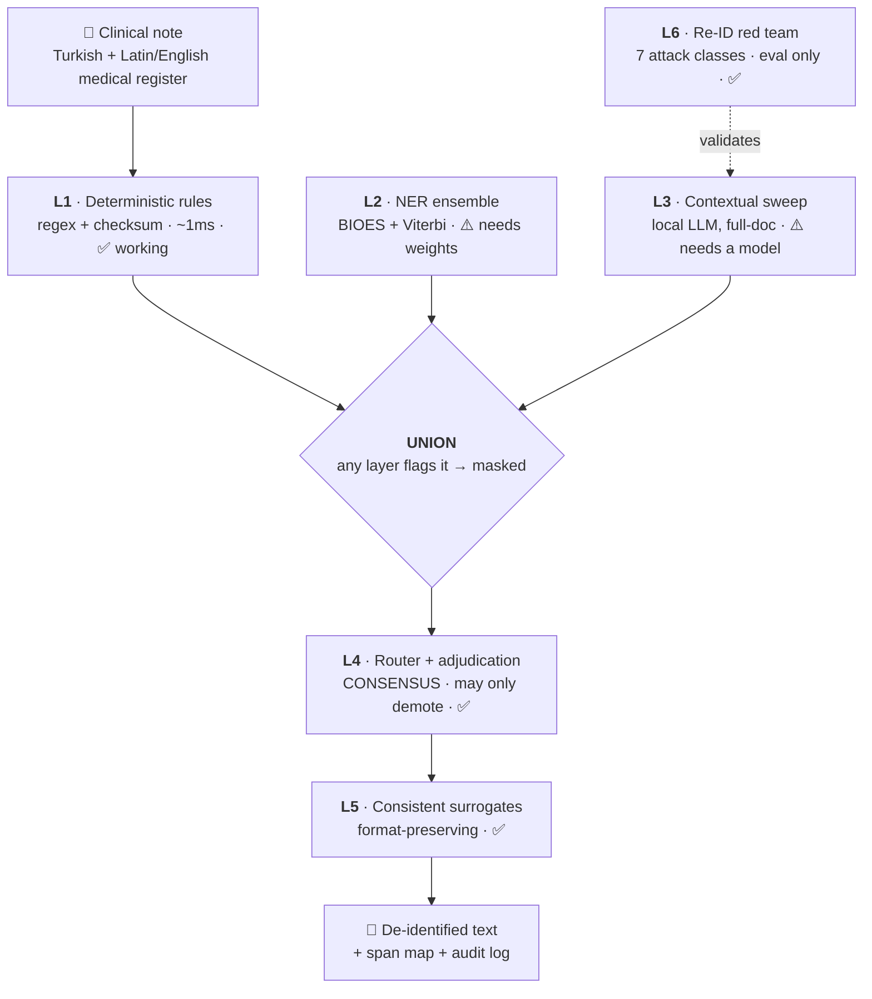

<div align="center">

# deid-tr 🇹🇷🏥

**PHI/PII de-identification for Turkish clinical text — and the benchmark that proves whether it works.**

[](LICENSE)
[](https://www.rust-lang.org)
[](#running-everything)
[](#the-guardrails)
[](#-read-this-before-you-use-it)
[](#i1-phi-never-leaves-the-device)

</div>

---

## 🚨 Read this before you use it

**Right now this tool does not mask names.** Not patient names, not clinician names, not relatives.

That is not a bug we're hiding in an issue tracker — it's the headline number, and here it is as a real run:

```console
$ deid mask note.txt
Konsultan: Prof. Dr. Marco Costa tarafindan degerlendirildi.        ← still there
Refakatci: Adalet Demir (kizi).                                     ← still there
Hasta Adi: Ayse Yilmaz    Dogum Tarihi: 29.07.1957                  ← name still there
TC Kimlik No: 189######## Telefon: +90 501 564 54 75                ← these got masked
E-posta: gokhan.akgunduz@ileti.example.tr
deid: masked 4 span(s)
```

Four spans. Zero names. **Do not put real patient data through this and send the output anywhere.**

The reason is honest and boring: layer L2 is the neural NER ensemble, and it has no trained model behind it yet. Everything around it — the decode path, the union logic, the adjudicator, the surrogates — is built and tested. The model isn't. See [what it needs](#-what-would-actually-help).

Our own red team puts the current re-identification rate at **0.9091** against a 0.05 ceiling. We publish that number rather than the flattering one. More on why below.

---

## What actually works today ✅

| | |
|---|---|
| 🇹🇷 **Turkish national IDs** | TCKN with the real checksum, VKN, SGK — recall **1.0000** |
| 🏦 **TR IBAN** | 26-char mod-97, recall **1.0000** |
| 📞 **Phone numbers** | `+90 5XX`, `0(5XX)`, `05XX`, landlines — recall **1.0000** |
| 📧 **Email** | recall **1.0000** |
| 🗂️ **MRN / protokol no** | recall **1.0000** |
| 📅 **Dates** | context-cued, with per-patient interval-preserving shift |
| 💊 **Medical vocabulary** | ~2,000 terms preserved, FP rate **0.0005** |
| 🎭 **Surrogates** | format-preserving — a fake TCKN that still passes its own checksum |

That last row matters more than it looks. Masking isn't `[REDACTED]`:

```diff
- TC Kimlik No: 526########
+ TC Kimlik No: 189########    ← different person, still a structurally valid TCKN
```

<sub>Digits are elided above on purpose. Real surrogates are full checksum-valid TCKNs, and a
checksum-valid ID must never be committed to this repo — I8 blocks it, including in this README.</sub>

Downstream systems that validate the format keep working. Date intervals survive, so "chemo three weeks after admission" is still three weeks after admission — just not on the real dates.

## What doesn't ❌

| Layer | State | Blocker |
|---|---|---|
| **L2** neural NER | mock only | needs a fine-tuned Turkish clinical checkpoint |
| **L3** contextual sweep | mock only | needs a local quantized LLM |
| **Python binding** | builds, unexercised | `pyo3` not in the offline cache |
| **WASM** | untested artifact | `wasm32-unknown-unknown` not installed here |

`--tier expert` refuses to run rather than quietly giving you weaker masking:

```console
$ deid mask --tier expert note.txt
deid: the Expert Determination tier requires a contextual (L3) layer, none configured
$ echo $?
1
```

---

## Why Turkish clinical text is its own problem 🧩

Two things break every off-the-shelf de-identifier, and they pull in opposite directions.

**1. Medicine code-switches, morphologically.** Turkish notes are written in Turkish but soaked in Latin and English medical vocabulary, and that vocabulary takes Turkish suffixes:

> `carcinoma'lı hasta` · `MRI'da` · `PET-CT'de` · `metformin'e` · `Behçet'li`

A Latin root with a genitive suffix and a Turkish surname with a genitive suffix are *the same shape*. Get it wrong in one direction and you leak half a patient's name; get it wrong in the other and you mask `carcinoma` and destroy the note. We keep ~2,000 terms in an allowlist — including the eponyms that literally contain a person's name:

> Behçet · Hodgkin · Crohn · Parkinson · Alzheimer · Wilson · Bell · Addison

And drug brands that read exactly like Turkish given names. `Adalat` is a calcium channel blocker. `Adalet` is somebody's daughter. One letter apart, both in the same note.

**2. The dangerous PHI isn't an entity at all.** No NER model will ever tag this:

> *"Hasta Merkez Bankası'nda uzman olarak çalışmaktadır. Eşi tanınmış bir hakimdir."*
> *(The patient works as a specialist at the Central Bank. His wife is a well-known judge.)*

There's no name in that sentence and it identifies one person. Same for *"they have a beach house in Dubai"* and *"the patient's daughter, a nurse in this same department."* These aren't entities — they're **meanings**, and catching them needs a model that reasons over the whole document.

That's the split the HIPAA Privacy Rule already makes, so we made it the product:

- **Safe Harbor** 🔒 — the 18 enumerated identifiers. Fast, mechanical, runs everywhere. Default.
- **Expert Determination** 🔬 — adds the full-document contextual sweep. Opt-in, because aggressive contextual masking trades readability for privacy.

---

## Architecture



**Two aggregation rules, one per error type.** This is the whole design in one idea:

- **Union for recall.** If *any* layer flags a span, it gets masked. We never majority-vote a span away. A converging council of detectors drops exactly the spans that only one sharp detector caught — that's a breach machine wearing a consensus hat.
- **Consensus for precision.** Only L4 debates, only over already-flagged spans, and it may **only demote, never invent**. A checksum-valid or multi-detector-agreed span can't be demoted at all — the refusal is a typed `Err`, not a silent no-op.

<details>
<summary><b>The bug that hid in there for a while</b> 🐛</summary>

`Span` originally carried only a `Layer` (Rules/Ner/Context), not a detector identity. So two *different* ensemble models proposing the byte-identical span were indistinguishable from *one* model emitting it twice. Both collapsed to `support: 1`, so `is_protected()` returned false and L4 could demote them.

The guardrail failed precisely where agreement was strongest — exact boundary agreement. The tests missed it because they used two different `Layer`s. Fixed by giving spans a real detector identity, and by making `Span`'s fields private so the safety flag can't be forged from a binding. An external-crate audit now proves eight separate forgery attempts fail at compile time.

</details>

---

## The benchmark 📊

**TurkDeID-Bench** — because no public Turkish clinical de-identification gold set existed. That's the actual moat here; models are the commodity.

```
112 synthetic clinical notes   (78 dev · 34 sight-unseen, structurally different note types)
 62 adversarial fixtures        (direct edge cases · medical-term traps · contextual)
1499 direct gold spans
 225 quasi-identifier spans
~2000 allowlist terms
```

Every gold span is a **verbatim quote plus occurrence index**, never a byte offset — hand-computed offsets over multi-byte Turkish silently inflate recall when a span gets dropped, and a build step resolves quotes to offsets and fails loudly on anything unresolvable.

### We report three numbers, never one

A 0.88 F1 with 0.85 NAME recall is a breach machine that looks fine on a leaderboard. So:

| | current | gate |
|---|---|---|
| Direct-identifier micro F1 | 0.5425 | ≥ 0.95 ❌ |
| Medical-term FP rate | 0.0005 | ≤ 0.005 ✅ |
| Contextual re-ID rate | 0.9091 | ≤ 0.05 ❌ |
| Document leak rate | 0.9474 | ≤ 0.02 ❌ |

**28 gates fail.** A compliance officer reading this report today should not sign off, and that's the report working correctly.

<details>
<summary><b>Why that 0.9091 is in the README instead of a much nicer 0.0303</b></summary>

For a while the contextual gate read `0.0303 PASS`. It was byte-identical for the null detector, the rules layer, and the full pipeline — because it was measured against a gold-derived *oracle* masker, not against our system. A detector that finds nothing scored the same as the real thing.

The gate is now provenance-checked: a red-team report may populate it **only** if it was produced by the pipeline masker on the matching run. Anything else leaves it `UNENFORCEABLE` — never `PASS`. The real number came back 0.9091 and six of seven attack classes breached.

Publishing the oracle number would have been exactly the failure this project was built to criticise: a headline metric that came from a different run.

</details>

---

## The invariants 🛡️

Eight rules. A change that violates one gets reverted, not debated — and they're enforced by hooks returning exit 2, not by good intentions. An instruction in a prompt is something you rationalise past at 2am. A hook is not.

#### I1 · PHI never leaves the device
`core/` has no network dependency — verifiable, not aspirational:
```console
$ cargo tree -p deid-tr-core
deid-tr-core
├── regex
└── thiserror
```
No socket in the graph. `just test-airgapped` runs the suite with networking shimmed to raise on use. **The contextual LLM is local, always** — sending PHI to a cloud model to detect its PHI defeats the entire point.

#### I2 · Recall is the product, precision is a feature
A missed identifier is a breach. An over-masked word is a papercut. Thresholds in `eval/thresholds.yaml` may only ever be **raised** — the file is write-blocked by a hook, and lowering one needs a human decision and an ADR.

#### I3 · Never bind `0.0.0.0`
Default `127.0.0.1`. The guard also catches `Ipv4Addr::UNSPECIFIED`, `SocketAddr::from(([0,0,0,0],…))`, `"::"` and `[::]`, because those are the idiomatic spellings people actually reach for.

#### I4 · Feedback on a miss is PHI
"You missed *Ayşe Yılmaz*" **contains a patient name.** False positives are exportable as a bare span; false negatives stay local forever and only the *pattern* is ever exported. No error type in `core/` carries text — every variant holds offsets, labels and lengths. `AuditEntry` has a hand-written `Debug` that prints `<redacted>`, because a derived `Debug` on a struct holding an LLM rationale is a breach with a `#[derive]` on it.

#### I5 · Model cards are build artifacts
Generated from a committed eval run. No human types a metric. This is the one rule that separates us from a competitor whose Turkish model cards carry `language: ar` and Arabic evaluation numbers.

#### I6 · Backbone/language gate · I7 · The golden set is append-only · I8 · No real PHI in the repo

I8 has teeth, and it bit us during this very commit:

```console
$ git commit -m "feat(eval): ..."
COMMIT BLOCKED [I8 checksum-valid-TCKN]
  a checksum-VALID Turkish national ID (TCKN) is staged. It could belong to a real person.
  locations (file:line - digits deliberately not shown):
    eval/redteam/tests/test_attacks.py:342
```

An agent had written a checksum-valid TCKN into a test file. The hook caught it, refused the commit, and reported the line number *without* printing the digits. Fixed by generating it at runtime instead.

---

## Try it

```bash
git clone https://github.com/ArioMoniri/PIIMa.git && cd PIIMa
just install-hooks     # do this first — it's the PHI gate
cargo build --workspace
```

```bash
just check             # fmt + clippy -D warnings + tests + eval
just eval              # score the benchmark, prints the three numbers
just red-team          # run the seven attack classes
just test-airgapped    # prove zero network syscalls
just test-hooks        # 263 guard cases, both directions
```

### Running everything

```console
$ cargo test --workspace
test result: ok. 500 passed; 0 failed        (23 suites)

$ python3 -m pytest tests/ eval/ -q
153 passed

$ ./scripts/hooks/test_hooks.sh
total 263   passed 263   failed 0

$ just test-airgapped
OK - zero network operations observed
```

Everything above is green — and the tool still doesn't mask names. That gap is the most useful thing in this repository: **a green suite is not evidence a product works.** We found it by driving the shipped binary by hand, not by reading the test output.

### 🔄 Auto-update

On by default, and it will tell you so on first run. It never fires while a clinical note is in memory, sends the version string and nothing else, and verifies an Ed25519 signature before installing anything. Turn it off three ways:

```bash
deid --offline mask note.txt      # per-invocation
DEID_NO_UPDATE=1 deid mask ...    # per-environment
echo 'auto_update = false' >> ~/.config/deid-tr/config.toml
```

Air-gapped installs are detected automatically and stop checking.

---

## 🙏 What would actually help

**A Turkish clinical NER checkpoint, or annotated clinical text under a DUA.** That's the single blocker on L2, and every ❌ in this README turns into a real number the day it exists.

To be explicit about why we can't just train on what's here: the 112 gold notes are the **test set**. Training on them would destroy the benchmark, and the benchmark is the point.

Also genuinely wanted:
- 🔍 **Adversarial fixtures.** Find a case we get wrong and open a PR adding it. A failing fixture is the most valuable commit type in this repo — the golden set is append-only precisely so nobody can quietly delete one to go green.
- 🗣️ **Native Turkish clinical review** of the fixtures — especially the vowel-harmony and code-switch coverage.
- 🤖 A small local LLM recommendation for L3 that runs on hospital hardware.

---

## Prior art

[OpenMed's NER work](https://arxiv.org/abs/2508.01630) is real research and we cite it as such. Where we differ is process, not people: publishing faster than you evaluate is how Turkish model cards end up carrying Arabic metrics. Our answer is I5 — cards are generated from a committed eval run or they don't ship.

Turkish backbones we gate against: BERTurk, BioBERTurk, ConvBERTurk, mDeBERTa-v3, XLM-R. Any `*-uncased` model is rejected outright for Turkish — lowercasing corrupts İ/I/ı/i, and casing is the strongest name signal there is.

Regulatory context: **KVKK** (Law No. 6698), under which health data is a special category, and the **HIPAA Privacy Rule** standards the two tiers map onto.

---

<div align="center">

**Apache-2.0** · Built in the open, including the parts that don't work yet.

*If you're a Turkish hospital and this is interesting but not yet usable — that's the correct read. Open an issue and tell us what would make it usable.*

</div>
